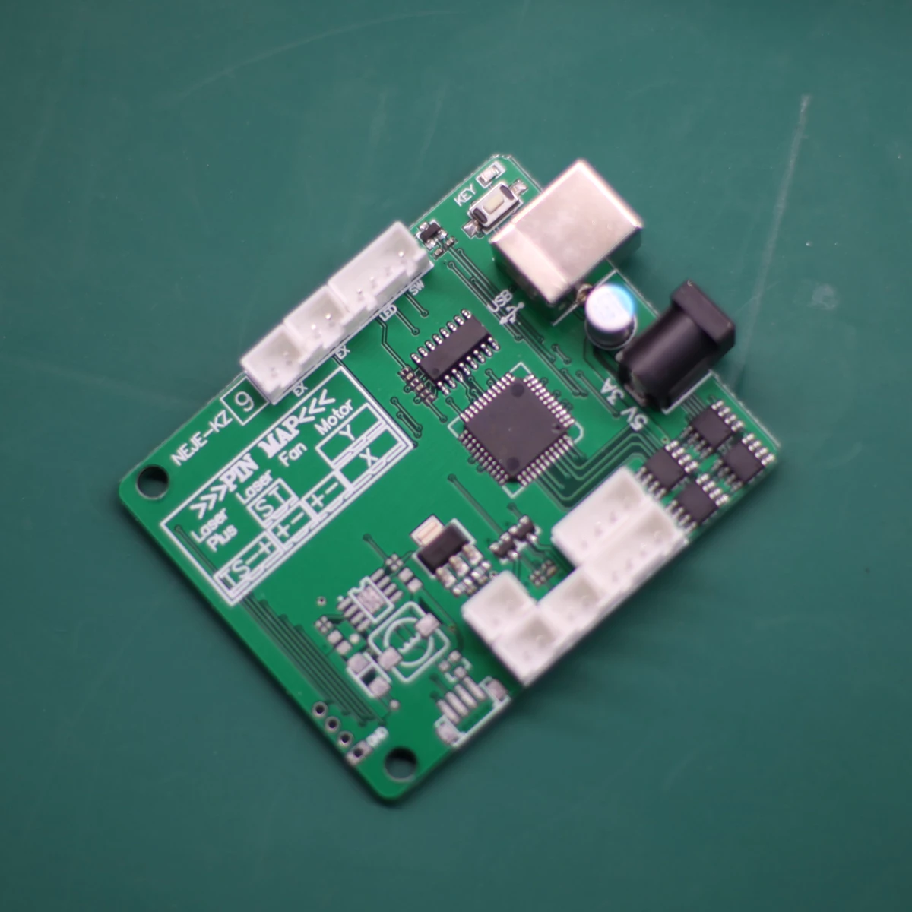
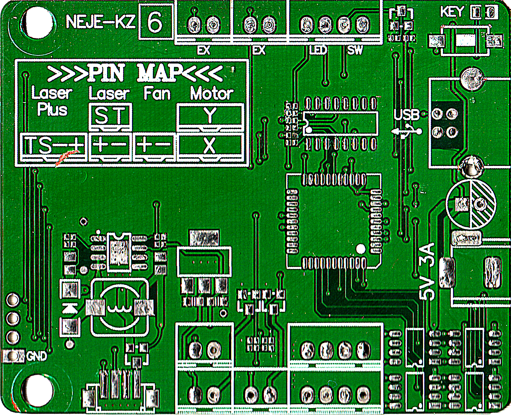
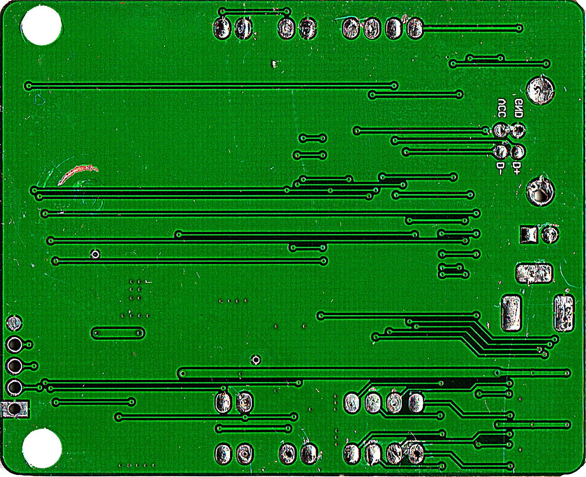

# NEJE-KZ Controller Board
Reverse-engineered schematic and layout for NEJE-KZ laser engraver controller board.

The schematic should be the same as for the original board. Parts should be correctly identified and connected. My goal was to find out the wiring to be able to replace the damaged original board with a board with my own design.

**Warning:** The reconstructed layout has not been manufactured or tested. Weird things can be found on this allegedly $25-worth Chinese board.

  

## BOM
| Qty | Part               | Value          | Package      | Additional info                |
|-----|--------------------|----------------|--------------|--------------------------------|
| 1   | C1                 | 560u/6.3V      | E2,5-7       |                                |
| 1   | C10                | 1n             | 0402         |                                |
| 4   | C2, C4, C5, C8     | 100n           | 0402         |                                |
| 1   | C3                 | 2n7            | 0402         |                                |
| 2   | C6, C7             | 1u             | 0603         |                                |
| 2   | C9, C11            | 1u             | 0805         |                                |
| 1   | D1                 | SS14           | SMA          | Schottky diode, 40V, 1A        |
| 1   | IC1                | STC8A4K16S2A12 | LQFP44-10X10 | STC8F family MCU               |
| 1   | IC2                | XC6206P332MR   | SOT23-3      | LDO, 3.3V, 200mA               |
| 1   | IC3                | AMS1117-5.0    | SOT223       | LDO, 5.0V, 1A                  |
| 1   | IC4                | CH340C         | SO16         | USB to Serial                  |
| 1   | IC5                | TX4223         | SOIC8        | DC-DC boost 5A converter       |
| 4   | IC6, IC7, IC8, IC9 | TC118S         | SOIC8        | Single channel DC motor driver |
| 1   | J1                 | USB-B          | USB-B-PTH    | USB B THT connector            |
| 1   | J10                | LASER-ST       | JST-XH-02    |                                |
| 1   | J11                | LASER_PLUS     | 1X04_1MM_RA  |                                |
| 1   | J12                | UART           | MA04-1       |                                |
| 1   | J2                 | DC 5.5/2.1mm   |              | THT DC jack connector          |
| 2   | J3, J4             | EX             | JST-XH-02    |                                |
| 1   | J5                 | LED-SW         | JST-XH-04    |                                |
| 1   | J6                 | MOTOR-X        | JST-XH-04    |                                |
| 1   | J7                 | MOTOR-Y        | JST-XH-04    |                                |
| 1   | J8                 | FAN            | JST-XH-02    |                                |
| 1   | J9                 | LASER-PWR      | JST-XH-02    |                                |
| 1   | L1                 | 470UH          | 8x8mm        | Eg. WE 74477724                |
| 1   | LED1               |                | 0805         |                                |
| 1   | Q1                 | SI2301         | SOT23-3      | P-Channel MOSFET               |
| 2   | Q2, Q3             | GMS2302AL      | SOT23-3      | N-Channel MOSFET               |
| 1   | R1                 | 1k             | 0402         |                                |
| 5   | R2, R3, R7, R8, R9 | 3k3            | 0402         |                                |
| 2   | R4, R10            | 10k            | 0402         |                                |
| 1   | R5                 | 270R           | 0402         |                                |
| 1   | R6                 | 6k2            | 0402         |                                |
| 1   | S1                 | BTN            | DTSM-3       | SMT Push-button                |
